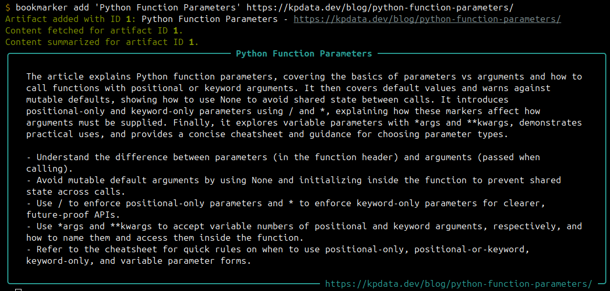
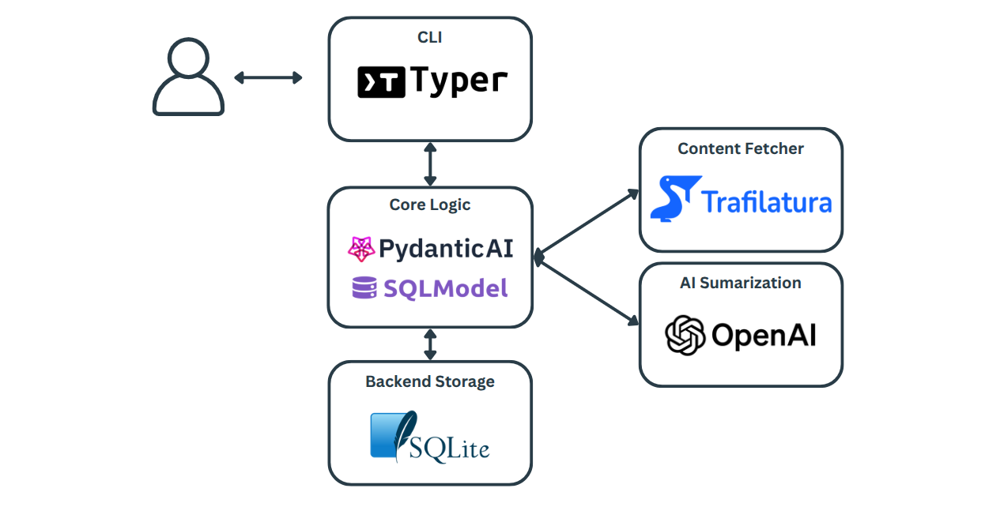

# bookmarker-ai

A CLI tool to manage the online articles you want to read. Too much content and too little time? Bookmarker helps you pick what to read.

You can...

- Add links to online articles.
- Auto fetch and summarize article content via OpenAI.
  - Read the summary to decide if you want to read the full article.
- Search, list, and tag your articles... all from the command line.


## Installation

Bookmarker-AI runs on Python 3.13+ and is [hosted on PyPI](https://pypi.org/project/bookmarker-ai/). Use your favorite package manager to install the package:

```bash
pip install bookmarker-ai
```

OR

```bash
uv add bookmarker-ai
```

### Configure App

Bookmarker-AI stores articles you add in a local SQLite database. It also requires an OpenAI API key.

1. Create OpenAI API key in your [OpenAI developer account](https://platform.openai.com/settings/organization/api-keys).
2. Run `bookmarker init` in the terminal. The app will prompt you about the database and API key.

```
$ bookmarker init
Created directory: '/home/mufasa/.bookmarker'.

🛠️  Database Setup
Would you like to create a database at '/home/mufasa/.bookmarker/bookmarker.sqlite'? [y/n]: y

🤖 Summarizer Config
Enter your OpenAI API key: enter-key-here
Enter your preferred OpenAI model name (gpt-5-nano):

✅ Configuration saved at: /home/mufasa/.bookmarker/config.env
You can edit this file anytime to adjust your settings.

🎉 Bookmarker is ready to use! Run `bookmarker --help` to see available commands.
```

## Usage

The quickest way to get started is running `bookmarker add` with an article title and URL. Bookmarker-AI will fetch the article content and send it to OpenAI for summarization. The summary will be stored in the SQLite database and presented in the terminal.



Run `bookmarker --help` to see the full list of commands:

```
(bookmarker) $ bookmarker --help

 Usage: bookmarker [OPTIONS] COMMAND [ARGS]...

╭─ Options ──────────────────────────────────────────────────────────────────────────────────╮
│ --install-completion          Install completion for the current shell.                    │
│ --show-completion             Show completion for the current shell, to copy it or         │
│                               customize the installation.                                  │
│ --help                        Show this message and exit.                                  │
╰────────────────────────────────────────────────────────────────────────────────────────────╯
╭─ Commands ─────────────────────────────────────────────────────────────────────────────────╮
│ init             Initialize local configuration (database and AI summarizer)               │
│ add              Add an artifact with a title and URL.                                     │
│ delete           Delete an artifact.                                                       │
│ list             List all artifacts.                                                       │
│ show             Show details for the specified artifact ID.                               │
│ search           Search for artifacts by title, URL, and tag                               │
│ tag              Add or remove tags from an artifact.                                      │
│ fetch            Fetch content for the specified artifact ID.                              │
│ fetch-many       Fetch multiple artifacts concurrently.                                    │
│ summarize        Summarize content for the specified artifact ID.                          │
│ summarize-many   Summarize multiple artifacts concurrently.                                │
╰────────────────────────────────────────────────────────────────────────────────────────────╯
```

When stored in the database, an artifact (e.g. article) has an ID. The ID is needed to perform standard CRUD operations. If the ID is not known, run the `search` or `list` commands to find the target artifact.

The raw content of an artifact can be manually retrieved using the `fetch` command. Running `summarize` will send the raw content to the selected OpenAI model to summarize the artifact. Both the raw and summarized content are stored in the database for local retrieval.

The corresponding `fetch-many` and `summarize-many` commands use multithreading to process multiple artifacts concurrently.

The full CLI documentation can be seen in [docs.md](./docs.md).

## Architecture

Bookmarker-AI is built around a core logic in Python with a thin CLI wrapper made with Typer. The backend defaults to SQLite and is managed via SQLModel. Content fetching is supplied by the Trafilatura library. Summarization is handled by Pydantic-AI interacting with OpenAI APIs.



## Contributing

Pull requests are welcome. For major changes, please open an issue first to discuss what you would like to change.

Please make sure to update tests as appropriate.

## License

[MIT](https://choosealicense.com/licenses/mit/)
